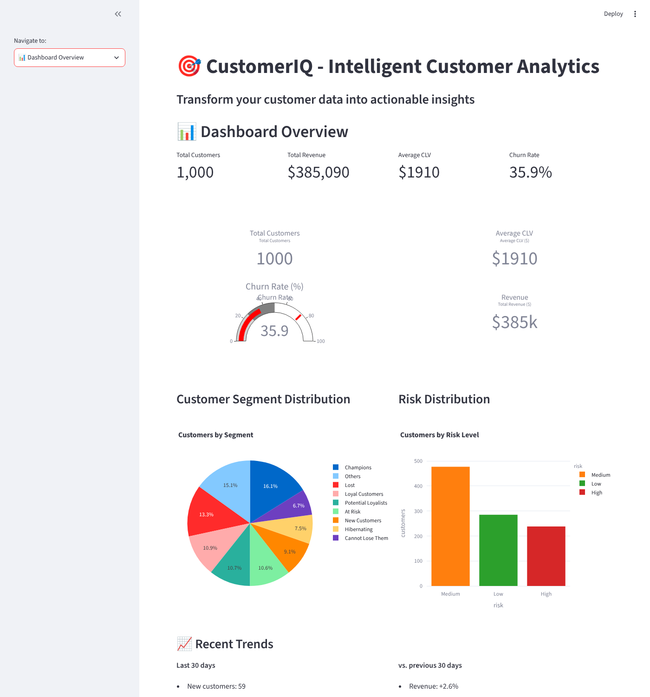
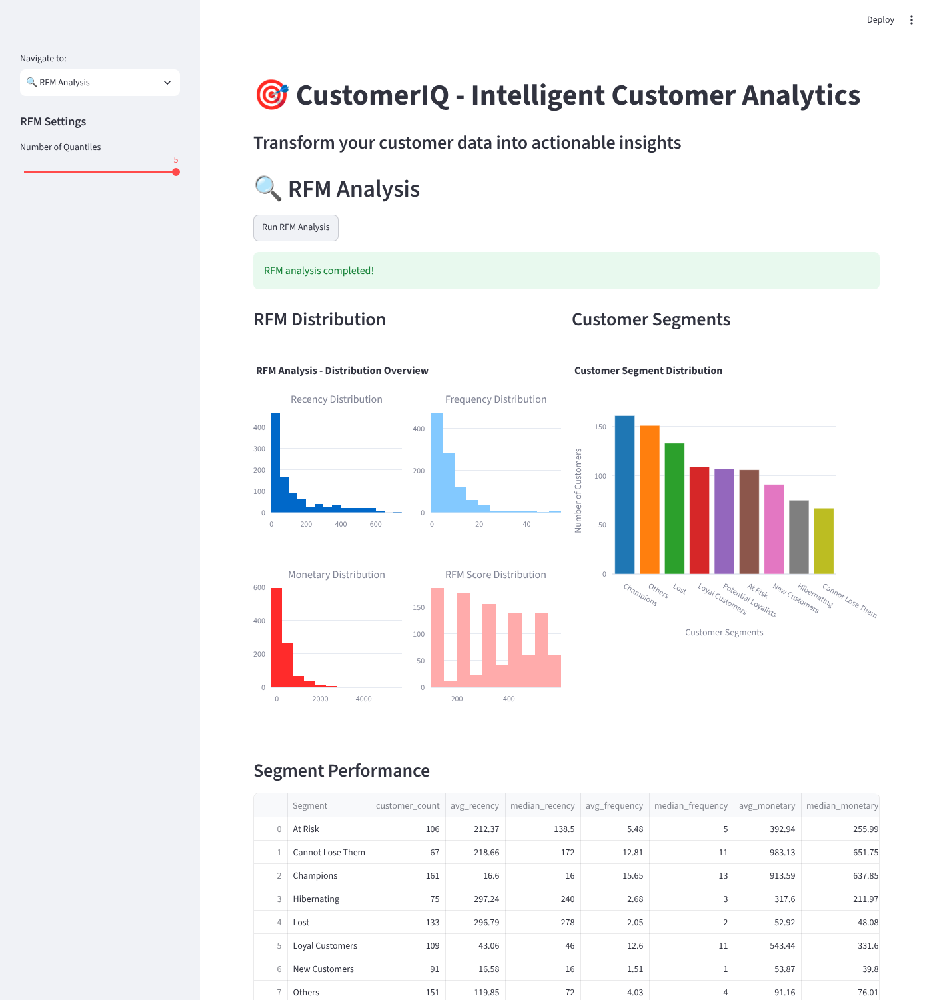
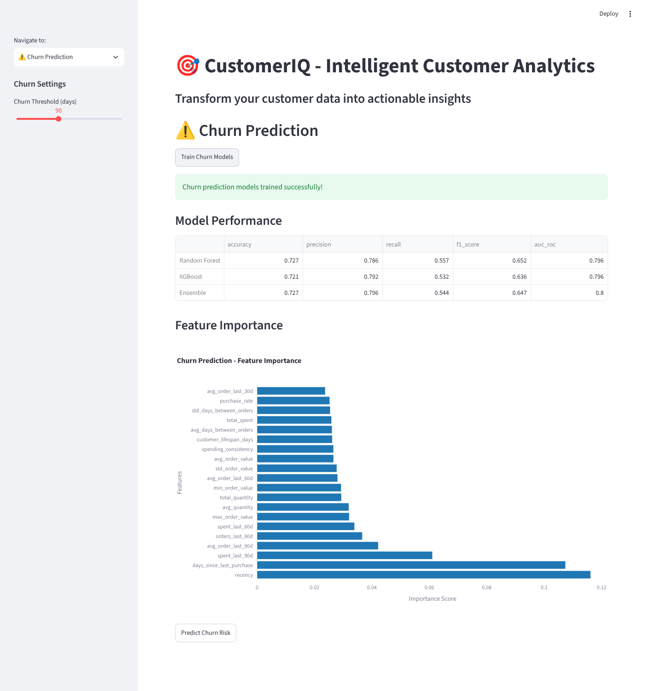
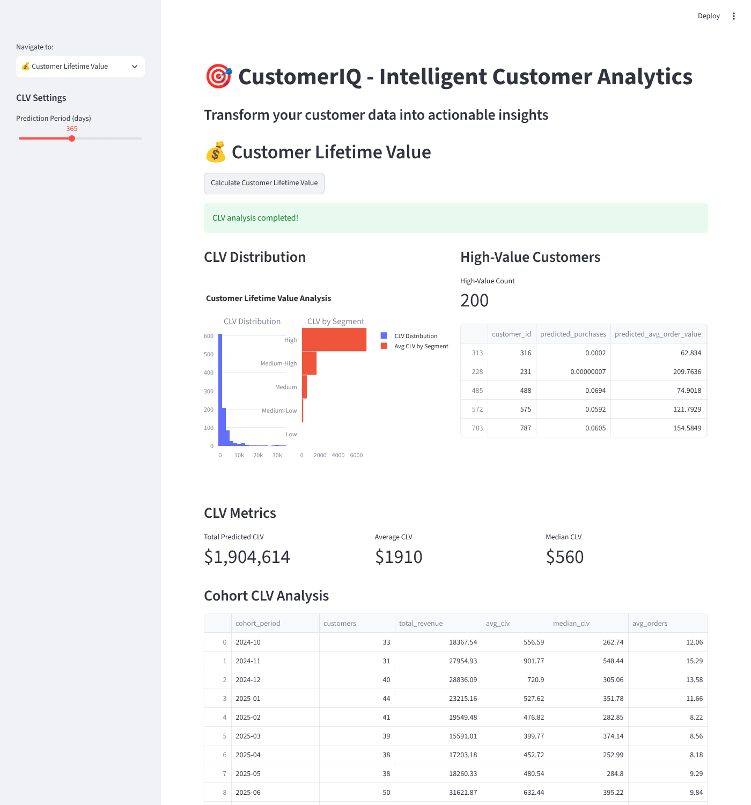

# CustomerIQ — Customer Segmentation, Churn & CLV Dashboard

[](https://github.com/mehmetarifkuzgun/customeriq/actions/workflows/ci-cd.yml)


A Streamlit app that takes e-commerce transaction data and produces **RFM segments**, a **churn-risk model** (Random Forest + XGBoost ensemble) and **customer lifetime value** estimates (BG/NBD + Gamma-Gamma, blended with an ML regressor), all stored in SQLite. It ships with a synthetic data generator, so everything below runs with one click and **no real customer data**.

| Dashboard | RFM segmentation |
|---|---|
|  |  |
| **Churn model** | **Customer lifetime value** |
|  |  |

*Screenshots are produced by [`scripts/capture_screenshots.py`](scripts/capture_screenshots.py), which drives the real app with Playwright on the built-in synthetic dataset.*

## What it does

| Page | What happens |
|---|---|
| Data Upload & Processing | Upload CSV/Excel (`customer_id, order_date, order_value, …`) or generate the synthetic sample; cleans transactions and builds per-customer features into SQLite |
| RFM Analysis | Quantile R/F/M scores (adjustable 3–5 bins), 9 named segments (Champions, At Risk, Lost, …) with segment statistics and recommended actions |
| Churn Prediction | Trains RF + XGBoost (grid-searched), shows accuracy / precision / recall / F1 / AUC and feature importance, then scores every customer into Low / Medium / High risk |
| Customer Lifetime Value | BG/NBD (expected purchases) × Gamma-Gamma (expected order value), an ML regressor, and a 60/40 blend; high-value customers, cohort CLV table |
| Dashboard, Segmentation, Business Insights | KPIs, segment/risk mixes, last-30-days trends, per-customer drill-down, CSV report export |

### How churn is defined (no label leakage)

A common pitfall is to label churn as `days_since_last_purchase > 90` and then feed `days_since_last_purchase` back in as a feature — the model scores a perfect 1.0 and learns nothing. Here the history is split at a **cutoff** (`last order − threshold`): features use only orders before the cutoff, and a customer is *churned* if they place **no order in the following threshold days** (the sidebar slider, default 90). See `ChurnPredictor.build_temporal_training_set` and its regression test.

On the synthetic data the ensemble reaches **AUC ≈ 0.80, accuracy ≈ 0.73** (screenshot above). Treat that as a check that the pipeline works, **not** as a business result: the data is generated from a simple buy-till-you-die simulation, and `recency` / `days_since_last_purchase` dominate the importance chart, as they should for that process.

## Quick start

```bash
git clone https://github.com/mehmetarifkuzgun/customeriq.git
cd customeriq
python -m venv .venv && source .venv/bin/activate      # Windows: .venv\Scripts\activate
pip install -r requirements.txt
streamlit run src/app.py                                # http://localhost:8501
```

Then: **Data Upload & Processing → Use Sample Dataset → Process Transaction Data**, and visit the other pages in order (RFM → Churn: *Train*, then *Predict* → CLV).

Docker: `docker compose up --build` (the image is built on Python 3.12; the Dockerfile was updated but not built in the environment this repo was prepared in — CI builds it on every push).

### Configuration

`config/settings.py` holds thresholds and paths; `DATABASE_URL` (env var) overrides the default SQLite file `customeriq.db`. Trained models are written to `models/` (git-ignored, like the DB and generated CSVs in `data/`).

## Tests

```bash
pip install -r requirements-dev.txt
pytest -q          # ~80 s; the churn grid search dominates
```

12 tests: transformations and models (original suite) plus regression tests for each bug found by running the app end to end — recency variety in the sample data, RFM on the default sample, **churn-leakage guard** (cutoff respected, AUC < 0.995 and > 0.6), BG/NBD convergence, and a **headless Streamlit run through every page** (`streamlit.testing.AppTest`, no browser). CI runs them on Python 3.11 and 3.12, plus a Docker build.

## Project structure

```
src/        app.py (Streamlit UI) · data_processor.py · rfm_analyzer.py · churn_predictor.py
            clv_calculator.py · database.py (SQLAlchemy / SQLite)
utils/      metrics.py (business metrics) · visualization.py (Plotly figures)
config/     settings.py
notebooks/  01–04 exploration, RFM, churn, CLV notebooks (not re-run in CI)
tests/      unit + regression + app-flow tests
scripts/    capture_screenshots.py
```

## Known limitations

- **Synthetic data only.** No real dataset ships with the repo and the reported metrics describe the simulator, not any business. Uploading your own CSV works through the same pipeline but column names must match the expected schema.
- **CLV models are only sanity-checked** (they converge and produce plausible values); there is no hold-out evaluation of CLV accuracy and the 60/40 blend weight is a fixed choice.
- Segment names, risk bands and action recommendations are rule-based heuristics, not learned.
- Streamlit re-creates the app object on every interaction, so state is passed through SQLite and `models/` (trained churn models are reloaded from disk when you press *Predict*).
- The notebooks were not re-validated while preparing this repo.
- No authentication; it's a local analytics tool, not a multi-user service.

## Fixes made while preparing this repo for publication

Found by actually running every page, then fixed with regression tests:

1. **App could not start on a clean install** — `BetaGeoFitter`/`GammaGammaFitter` were imported from `lifelines` (they live in `lifetimes`); the failed import was swallowed and the constructor crashed.
2. **Sample data was degenerate** — every multi-order customer's last purchase was "yesterday", so RFM crashed with `Bin edges must be unique` on the app's own default dataset. The generator is now a purchase/dropout simulation.
3. **Churn model scored 1.0 on everything** (label leakage, see above).
4. RFM / CLV / churn results could not be written to SQLite (table schemas didn't match the frames); *Predict* after *Train* always failed (model not persisted across Streamlit reruns); the dashboard's risk chart and the Business Insights page raised errors (wrong column names); the "Churn Threshold" slider wasn't wired to anything; "Recent Trends" were `TBD` placeholders and now show real last-30-days numbers.
5. Housekeeping: removed a committed `.pyc`, added `.gitignore`; `requirements.txt` listed the uninstallable `sqlite3` and unused packages, now tested version ranges; CI no longer references secrets/Slack/deploy steps that could not run; Dockerfile moved off Python 3.9 and now installs `curl` for its own health check.

## License

No license file is included yet — add one before reusing the code.
